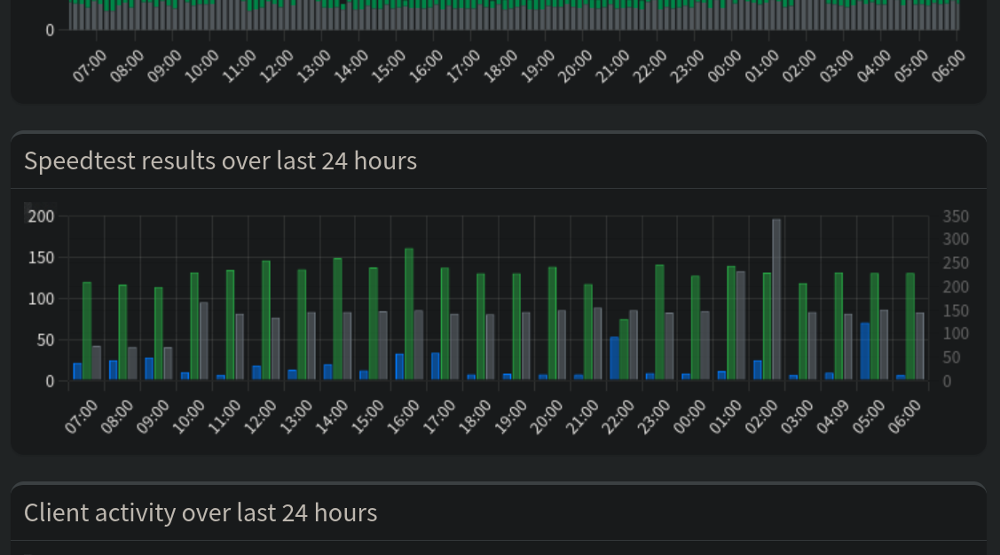
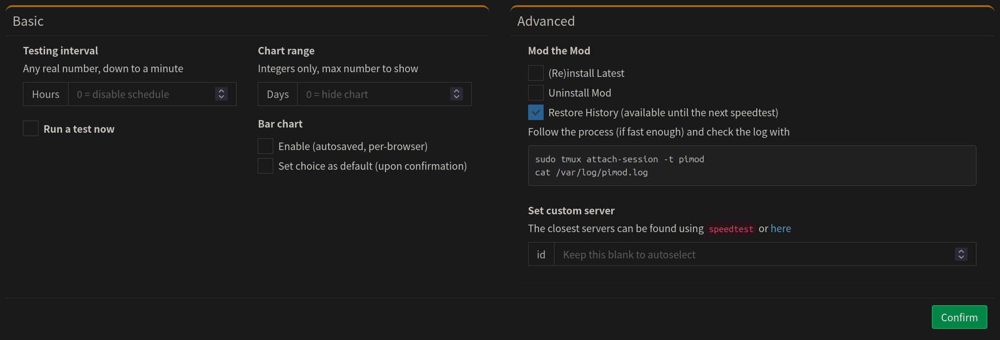

# Pi-hole Speedtest

## The Speedtest Mod for Pi-hole

 

---

Test your connection speed directly in the Pi-hole web interface! We try running speedtests using [Ookla's `speedtest`](https://www.speedtest.net/apps/cli), unless you already have [`speedtest-cli`](https://github.com/sivel/speedtest-cli) or [`librespeed`](https://github.com/librespeed/speedtest-cli) installed as `/usr/bin/speedtest`. Should one of these fail, the others will be tried.

Please keep in mind that:

* the more tests you run, the more data will be used, and
* any issues about weird results should be directed to the maintainers of whichever speedtest package is installed on your system, not here; use `/usr/bin/speedtest --version` to find out which one you have.

## Features

Pull requests and suggestions are welcome!

* Fast and safe un/re/install and update script (Mod the Mod)
* Supports Debian, Fedora, and derivatives with and without `systemd`
* A pretty line or bar chart on the dashboard of any number of days
* Test ad-hoc and/or on a schedule, with automatic failover
* List the results and export them as a CSV in the log
* View logs and servers in settings
* Flush or restore the database
* Customizable speedtest server
* Everything is a button — no CLI required after install

## Usage

The Mod Script by @ipitio can un/re/install and update the mod, and manage its history, for you. It accepts up to three arguments: any, all, or none of `up`, `un`, and `db`. They must be in that order; check usage for details. Its functionality is available via the web interface as well (Settings > Speedtest).

### Install

Install (or reinstall) the latest version of the Mod and only the Mod. For information about Pi-hole in Docker, including an example, please refer to their [repo](https://github.com/pi-hole/docker-pi-hole/) and [docs](https://docs.pi-hole.net/).

<strong>Via the Shell</strong>

You can just pipe to bash! If you're using Docker, you'll need to run this command in the container (after every rebuild -- use Compose).

    curl -sSLN https://github.com/arevindh/pi-hole/raw/master/advanced/Scripts/speedtestmod/mod.sh | sudo bash

<strong>Docker Compose</strong>

Replace `image: pihole/pihole:latest` with the following in your `compose.yml`, then rebuild without cache.

    build:
        dockerfile_inline: |
            FROM pihole/pihole:latest
            RUN curl -sSLN https://github.com/arevindh/pi-hole/raw/master/advanced/Scripts/speedtestmod/mod.sh | sudo bash

### Update

This is `(Re)install Latest` in the web interface.

> **Docker Note**
> You should only update via the shell or web if a new version of the Mod is released for the same Pi-hole core version. Neither the script nor the button in settings will run Pi-hole's update in Docker.

<strong>Via the Shell</strong>

The same as the above command, but also runs Pi-hole's update.

    curl -sSLN https://github.com/arevindh/pi-hole/raw/master/advanced/Scripts/speedtestmod/mod.sh | sudo bash -s up

<strong>Docker Compose</strong>

You can use the button or the shell, or rebuild the image without cache, for example:

    docker compose down; docker compose build --no-cache; docker compose up -d

### Uninstall

The Mod and only the Mod will be removed. The database will be preserved if it's not empty, but its backup will be deleted; be careful when uninstalling and clearing history.

<strong>Via the Shell</strong>

You guessed it:

    curl -sSLN https://github.com/arevindh/pi-hole/raw/master/advanced/Scripts/speedtestmod/mod.sh | sudo bash -s un

<strong>Docker Compose</strong>

After using the button in settings, or the shell if you so choose, revert the `build` back to an `image` so the Mod doesn't reinstall on the next rebuild. You can also comment out the `RUN` line:

    build:
        dockerfile_inline: FROM pihole/pihole:latest
            # RUN curl -sSLN ...

## Last Sync with Upstream

### Dec 09 2023

Web 5.21

<strong>History</strong>

### Jun 08 2023

Pi-hole 5.17.1 FTL 5.23, Web 5.20.1

### Jan 05 2023

Pi-hole 5.14.2 FTL 5.20, Web v5.18

Wishing everyone a very happy New Year!

### Nov 24 2022

Pi-hole 5.14.1 FTL 5.19.1, Web v5.17

### Oct 18 2022

Pi-hole v5.13 FTL v5.18.2, Web v5.16

### Oct 01 2022

Pi-hole 5.12.2 FTL 5.18.1 Admin LTE 5.15.1 , Docker 2022.09.4

### Sep 08 2022

Pi-hole FTL v5.17, Web v5.14.2 and Core v5.12

### Sep 04 2022

Pi-hole FTL v5.17, Web v5.14.1 and Core v5.12

### Aug 29 2022

Pi-hole docker update

### Jul 11 2022

Pi-hole core v5.11.4

### Jul 09 2022

Pi-hole FTL v5.16, Web v5.13 and Core v5.11.3

### Apr 24 2022

Pi-hole FTL v5.15, Web v5.12 and Core v5.10

### Feb 21 2022

Pi-hole Web v5.11.1

### Feb 16 2022

Updated Pi-hole FTL v5.14, Web v5.11 and Core v5.9

### Jan 08 2022

Updated to Pi-hole v5.8.1 Core / FTL v5.13 / 5.10.1 Web

### Dec 26 2021

Updated to pihole 5.7 Core / 5.9 Web

### Oct 24 2021

Updated to pihole 5.6 Core / 5.8 Web

### Oct 01 2021

Updated to pihole 5.5 Core / 5.7 Web

### Sep 16 2021

Updated to pihole 5.4 Core / 5.6 Web

### Apr 15 2021

Updated to pihole 5.3.1 Core / 5.5 Web

### Jan 20 2021

Updated to pihole 5.2.4 Core / 5.3.1 Web

### Jan 18 2021

Updated to pihole 5.2.3 Core / 5.3 Web

### Dec 25 2020

Updated to pihole V5.2.2

### Dec 04 2020

Updated to pihole V5.2.1

### Nov 30 2020

Updated to pihole 5.2(Web) & 5.2(Core)

### Aug 13 2020

Updated to pihole 5.1.1 (Web) & 5.1.2 (Core)

### Jul 20 2020

Updated to version v5.1

### May 11 2020

Updated to admin version v5.0

### Feb 26 2020

Updated to admin version v4.3.3

### Sep 24 2019

Updated to admin version v4.3.2

### Sep 19 2019

Updated to core version v4.3.2

### Jul 02 2019

Updated to version v4.3.1

### May 19 2019

Updated to Pi-hole core, Web v4.3

### Mar 07 2019

Updated to Pi-hole core v4.2.2

### Feb 14 2019

Updated to Pi-hole core v4.2.1

### Dec 31 2018

Speedtest mod is up to date with Pi-hole v4.1.2

### Dec 12 2018

Speedtest mod is up to date with Pi-hole v4.1

### Aug 07 2018

Speedtest mod is up to date with Pi-hole v4.0

Pi-hole v4.0 released on 2018-08-06. Speedtest mod integration is going on will take approx 3 to 5 days.

## Buy me a ☕️

Buy @arevindh a ☕️ if you like this project :)

